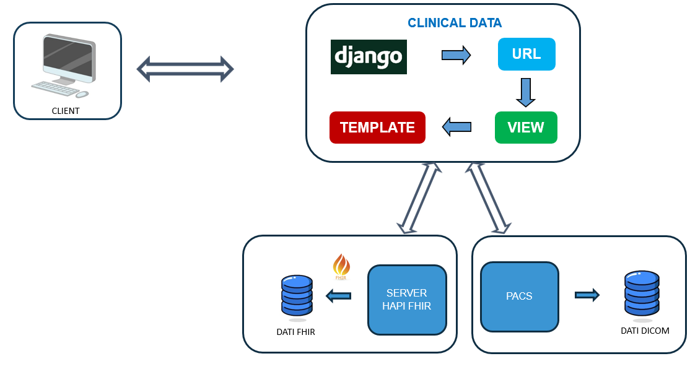
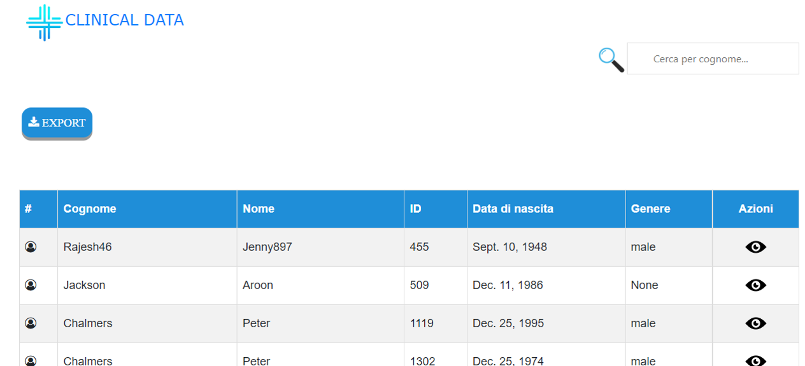
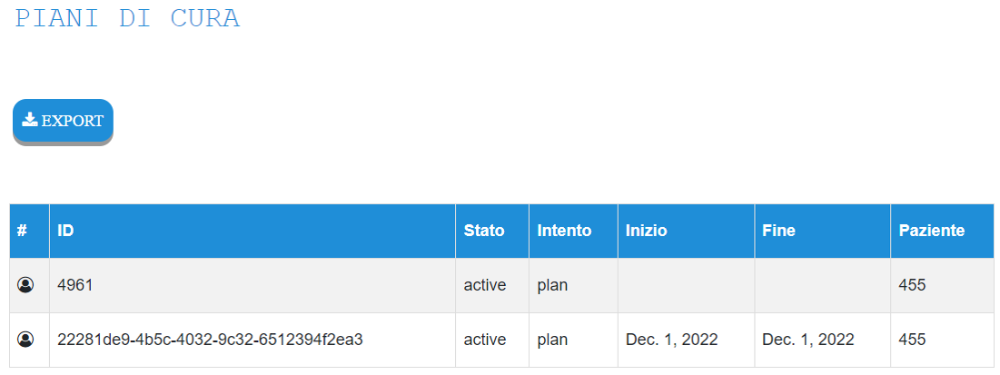
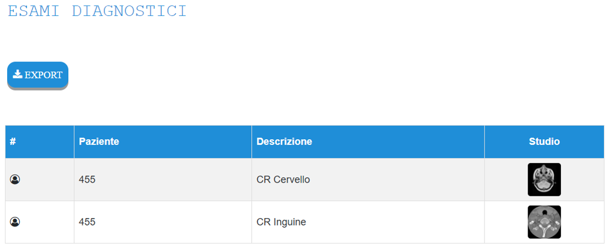
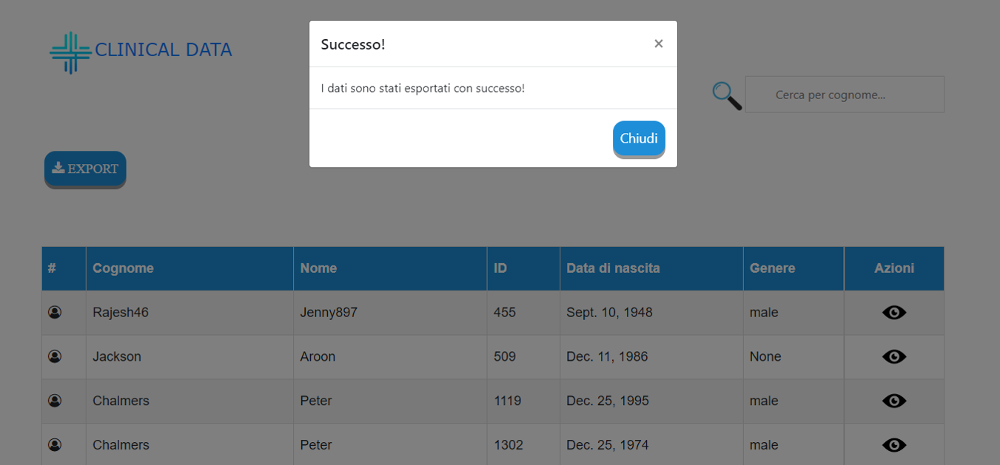

# API-estrazione-dati-sanitari

L’applicazione in questione è stata progettata ed implementata con l’idea di creare una piattaforma / sistema innovativo di interoperabilità per gestire il flusso di informazioni sanitarie mediante lo standard FHIR.  
L'applicazione presenta tre benefici chiave:  
1. Gestione e coordinamento delle informazioni
2. Efficienza operativa  
3. Esportazione dei dati   

Una novità implementata nel progetto è la possibilità di visualizzare non solo i dati anagrafici, dei piani di cura ecc... ma anche immagini DICOM richieste direttamente da un PACS (Picture Archiving and Communication System) presente nel Regno Unito e questo è possibile mediante chiamate WADO-URI (Web Access to DICOM Objects - Uniform Resource Identifier).  
In questo progetto sono stati utilizzati:  
1. Django
2. Server FHIR: HAPI FHIR
3. PACS: Medical Connection 
4. VsCode
5. Python  

## Architettura del progetto:  

## INFORMAZIONI UTILI ALL'AVVIO DELL'APPLICAZIONE

1.  Versione Django: 5.0
2.  Versione Python: 3.12
3.  HAPI FHIR: Public Test Server R5 (R5 sarebbe la versione 5 di FHIR)
4.  PACS: Public PACS    

## DIPENDENZE NECESSARIE ALL'AVVIO DELL'API
Per poter interagire con l'applicazione progettata ed implementata sono necessarie alcune dipendenze python:  
      1. requests  
      2. fhir.resources  
In particolare:  
1. **Requests** è una libreria semplice ma efficace che consente di inviare richieste al server. E' possibile installarla con il seguente comando da terminale:  

       pip install requests  

2. **fhir.resources** è una specifica per lo scambio elettronico di informazioni sanitarie. E' stato progettato per facilitare lo scambio di dati tra diversi sistemi e applicazioni sanitarie ed è comunemente utilizzato per creare API per i dati sanitari (come in questo caso). Per quanto riguarda l'installazione è sufficiente digitare il seguente comando da terminale:

       pip install fhir.resources

## COME AVVIARE L'API?  
All'interno della cartella di progetto è necessario aprire il Prompt dei comandi e digitare il seguente comando:    

    python manage.py runserver

Attraverso un qualsiasi browser digitare http://localhost:8000/api/ ed è possibile interagire con il sistema implementato.

### ESEMPIO  
* Sull'indirizzo precedentemente citato troviamo la homepage dell'API caratterizzata da una lista di tutti i pazienti reperiti dal server HAPI FHIR    

    

* Per ogni paziente è possibile visualizzare la relativa pagina dettaglio caratterizzata da due sezioni: rispettivamente i piani di cura e gli esami diagnostici (esempio paziente *455*) 

  

    

* Ulteriore caratteristica dell'API è la possibilità di visualizzare a schermo intero ogni singola immagine DICOM cliccando sulla stessa. 

* L'API consente l'esportazione in locale dei dati visualizzati cliccando sul tasto *EXPORT*  

    

## CONCLUSIONI
E' stata sviluppata un' applicazione realmente funzionante comprensiva di:  
* Automatizzazione dell’accesso ai dati  
* Aggiornamento in tempo reale dei dati
* Interoperabilità tra le diverse componenti
* Esportazione dei dati 

